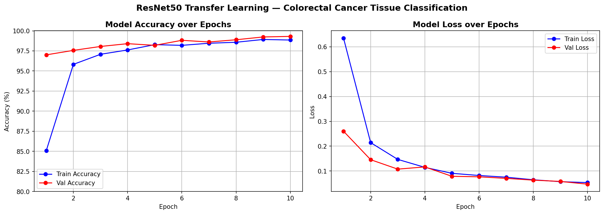
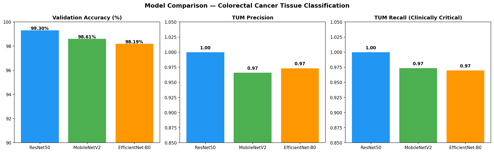
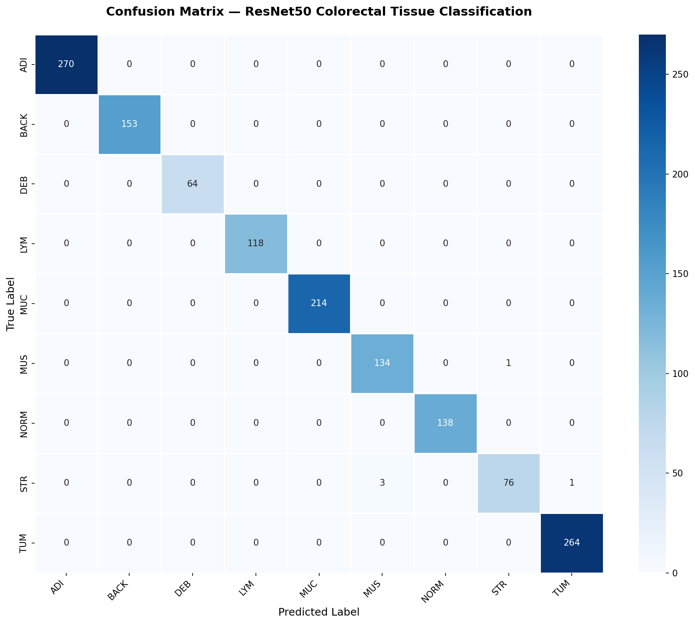

# colorectal-cancer-classification


PROJECT DETAILS
# Colorectal Cancer Tissue Classification using Deep Learning

A comparative study of CNN architectures for automated classification of colorectal cancer histopathology images using transfer learning on H&E-stained tissue patches.

---

## Project Overview

This project implements and compares three pretrained CNN architectures (ResNet50, MobileNetV2, EfficientNet-B0) for classifying colorectal cancer tissue patches from the NCT-CRC-HE-CRC-7K dataset into 9 tissue categories. The goal is to evaluate model suitability for AI-assisted colorectal cancer detection pipelines.

This work was self-initiated as part of preparation for research in medical image analysis, building on prior experience in Python-based biomedical signal processing pipelines developed at IIT Hyderabad.

---

## Dataset

**NCT-CRC-HE-CRC-7K** — 7,180 H&E stained histopathological image patches (224×224px) across 9 tissue classes:

| Class | Description | Images |
|-------|-------------|--------|
| TUM | Tumour epithelium | 1233 |
| NORM | Normal colon mucosa | 741 |
| STR | Cancer-associated stroma | 421 |
| MUC | Mucus | 1035 |
| LYM | Lymphocytes | 634 |
| MUS | Smooth muscle | 592 |
| ADI | Adipose tissue | 1338 |
| BACK | Background | 847 |
| DEB | Debris | 339 |

**Source:** Kather et al., Zenodo (https://zenodo.org/record/1214456)

---

## Methodology

- **Split:** 80% train / 20% validation (fixed seed for reproducibility)
- **Preprocessing:** Resize to 224×224, ImageNet normalization
- **Augmentation:** Random horizontal/vertical flip, 90° rotation, color jitter
- **Training strategy:** Transfer learning — frozen backbone, retrained final classification layer only
- **Optimizer:** Adam (lr=0.001)
- **Scheduler:** ReduceLROnPlateau (patience=3, factor=0.1)
- **Epochs:** 10
- **Batch size:** 32
- **Hardware:** NVIDIA GeForce RTX 3050 Laptop GPU (4GB VRAM)

---

## Results

### Overall Performance

| Model | Val Accuracy | TUM Precision | TUM Recall | Trainable Params |
|-------|-------------|---------------|------------|-----------------|
| **ResNet50** | **99.30%** | **1.00** | **1.00** | 18,441 |
| MobileNetV2 | 98.61% | 0.97 | 0.97 | ~16,000 |
| EfficientNet-B0 | 98.19% | 0.97 | 0.97 | ~16,000 |

 Key Finding
ResNet50 achieved perfect TUM (tumour) recall of 1.00, meaning zero missed tumour patches on the validation set. In a clinical screening context, TUM recall is the most critical metric — a false negative (missed tumour) carries significantly higher clinical cost than a false alarm. This makes ResNet50 the recommended architecture for deployment in cancer detection pipelines despite its larger size compared to MobileNetV2 and EfficientNet-B0.

---

 Visualizations

 Training Curves


Model Comparison


Confusion Matrix (ResNet50)


Grad-CAM Interpretability


Grad-CAM heatmaps show which regions of each tissue patch the model attends to when making predictions — red regions indicate high attention. This addresses the "black box" criticism of deep learning in clinical settings by providing visual interpretability.


 How to Run
 Run these files in your powershell

 ******MUST HAVE ANACONDA AND JUPYTER INSTALLED*****
 
```bash
# 1. Clone the repository
git clone https://github.com/yourusername/colorectal-cancer-classification.git

# 2. Create environment
conda create -n colorectal python=3.11 -y
conda activate colorectal

# 3. Install dependencies
pip install torch torchvision --index-url https://download.pytorch.org/whl/cu121
pip install jupyter matplotlib numpy pandas scikit-learn opencv-python pillow tqdm grad-cam seaborn

# 4. Download dataset from https://zenodo.org/record/1214456
# Extract NCT-CRC-HE-CRC-7K.zip into project folder

# 5. Open notebook
jupyter notebook colorectal_classifier.ipynb
```

---

## Author

Sarthak Sakharkar
B.Tech Bioengineering, MIT-WPU Pune
GATE Biomedical Engineering 2025 (Rank < 400)
Research Intern, IIT Hyderabad

[LinkedIn](https://www.linkedin.com/in/sarthak-sakharkar-98b54028a)
